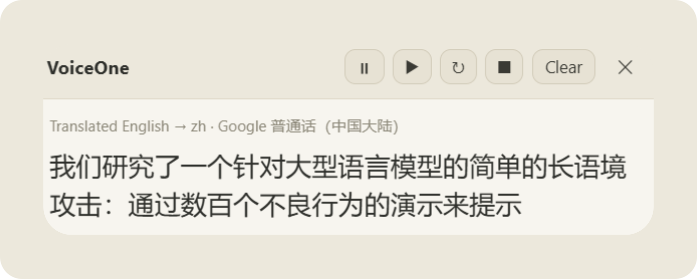
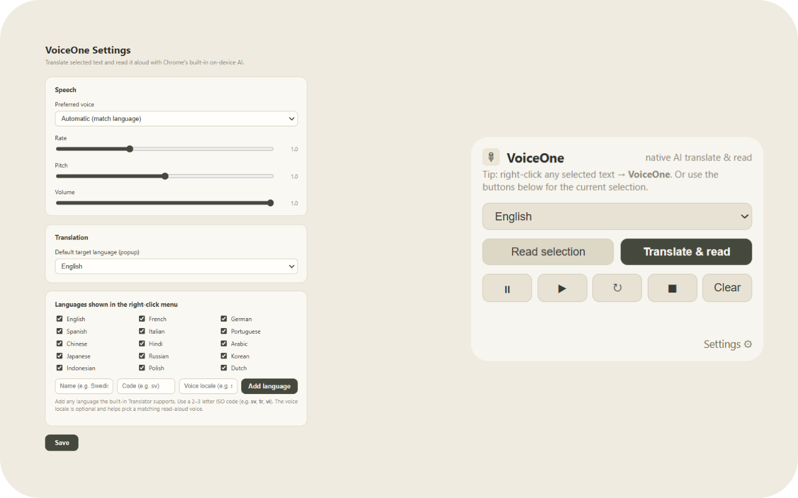

# VoiceOne

Select any text, **translate it**, and have it **read aloud** — entirely with Chrome's
**native, on-device AI**. Works on regular web pages and inside Chrome's built-in PDF viewer.

Everything runs locally in the browser:

- **Translation** → built-in **`Translator`** + **`LanguageDetector`** APIs
- **Speech** → native **`chrome.tts`** API

---

## Screenshots

The floating panel reading a translation aloud:

Settings and the toolbar popup:

---

## Features

- **Right-click → VoiceOne** on any selected text:
  - **Auto Read Original Language** — reads the selection aloud in its own language.
  - **Translate & Read ▸ &lt;language&gt;** — translate into one of ~15 languages and read it.
- **Floating control panel** with **Pause · Resume · Repeat · Stop · Clear · ✕** and a live
  status line (e.g. `Translated mixed → fr · Google français`). Drag it by the header.
- **Toolbar popup** mirrors the panel and works as a fallback control surface.
- **Options** for voice, rate, pitch, volume, default target language, and which languages
  appear in the menu — including **adding your own language** (name + ISO code + optional voice
  locale) beyond the built-in set.

---

## Requirements

- **Google Chrome 138 or newer** (built-in AI APIs).
- Chrome's on-device translation models download on **first use** of a language pair (you'll see
  a "Downloading model… %" status). If a model or language pair isn't available, VoiceOne tells
  you and (where possible) reads the original text instead.

---

## Install (unpacked)

1. Open `chrome://extensions`.
2. Toggle **Developer mode** (top-right).
3. Click **Load unpacked** and select the `D:\Claude\VoiceOne` folder.
4. (For local PDFs via `file://`) click **Details** on VoiceOne and enable
   **Allow access to file URLs**.

---

## Usage

1. Select text on any page (or in a PDF).
2. Right-click → **VoiceOne** → **Auto Read Original Language** or **Translate & Read ▸ a language**.
3. The floating panel appears, shows the (translated) text, and reads it aloud. Use the panel or
   the toolbar popup to pause/resume/repeat/stop.

You can also click the toolbar icon to read the current selection, translate to your default
language, control playback, or open **Settings**.

---

## Project layout

| File | Role |
| --- | --- |
| `manifest.json` | MV3 manifest, permissions, menu |
| `background.js` | Service worker: menus, detection, translation, `chrome.tts`, panel state |
| `panel.js` | Floating control panel injected into the page (Shadow DOM) |
| `popup.html` / `popup.js` | Toolbar popup + fallback controls |
| `options.html` / `options.js` | Preferences (`chrome.storage.sync`) |
| `lib/languages.js` | Language list + TTS hints |
| `icons/` | Toolbar/store icons |

---

## Troubleshooting

- **"No on-device model for X → Y"** — that language pair isn't supported by the built-in
  Translator on your Chrome build; try another target or update Chrome.
- **Panel doesn't appear over a PDF** — use the **toolbar popup**, which mirrors the same
  controls and status.
- **No voice / wrong language voice** — install or pick a voice in **Settings**; some languages
  use Chrome's online "Google" voices, which need a network connection.

---

*VoiceOne is a local-first demo of Chrome's built-in AI.*
